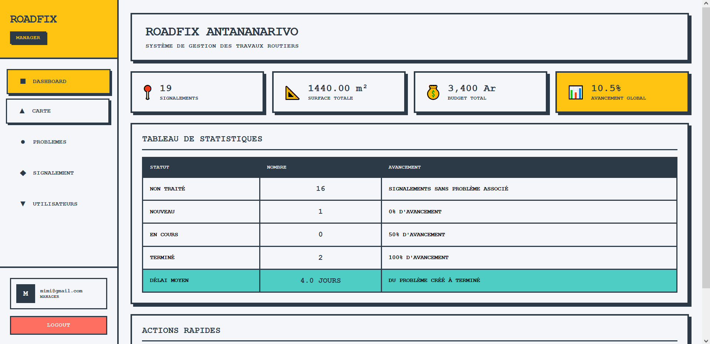
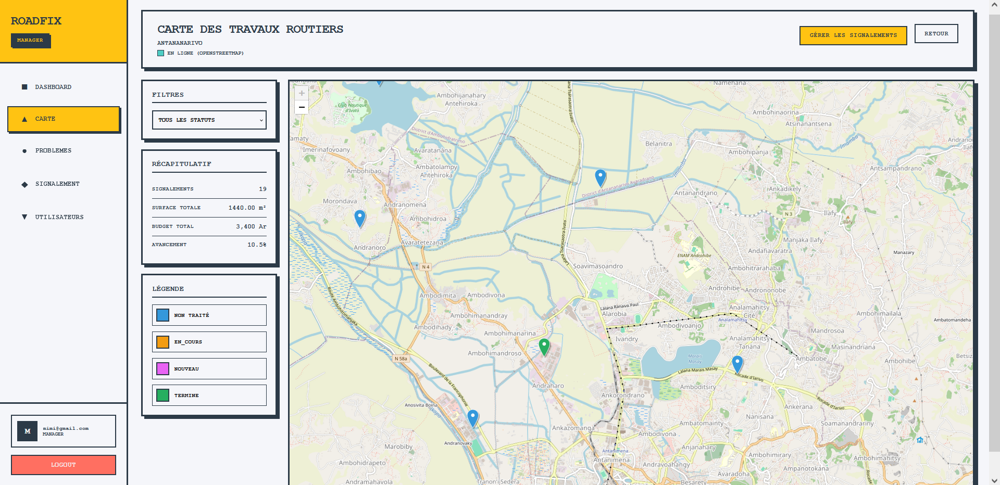
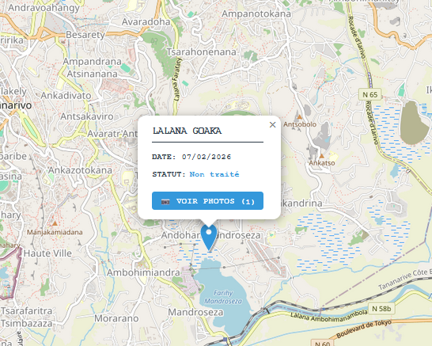
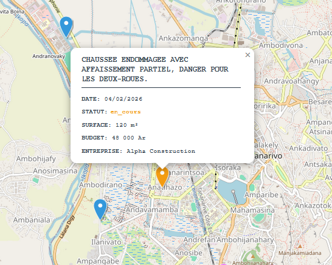
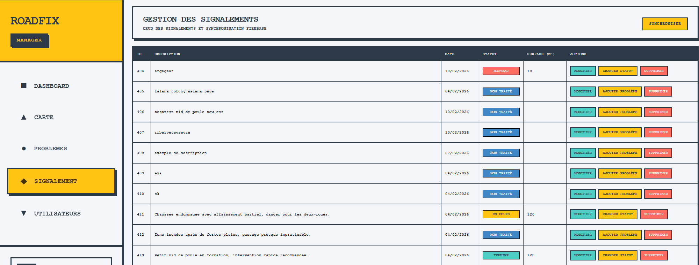
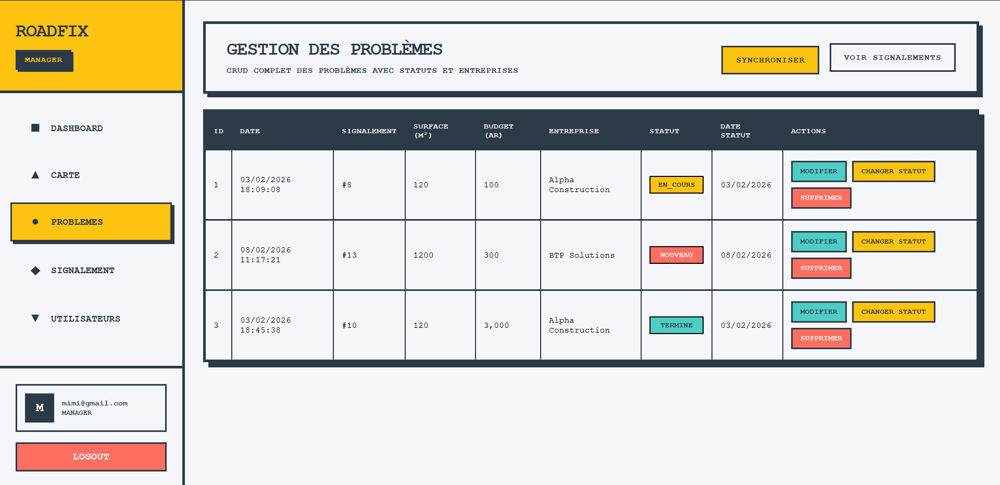
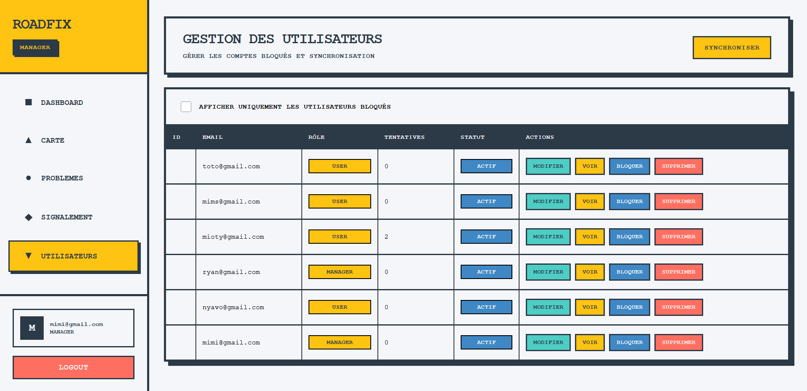

# S5_Cloud_Carte

A cloud-deployed, multi-platform road issue reporting system. Mobile users submit geolocated reports (signalements) with photos and GPS coordinates. A web admin interface lets managers assign those reports to contractors and track resolution status. Everything syncs in real time through Firebase.

Built as a cloud computing project, the goal was to architect a system across three separate clients — a Spring Boot API, a React web dashboard, and an Ionic mobile app — and keep them in sync without tight coupling.

## Features

### What it does

- Mobile app (Ionic/Capacitor): report a road issue with GPS coordinates, description, and photo; view your own reports and their current status
- Web dashboard (React): view all reports on an interactive map with offline tile support; filter by status (nouveau, en cours, terminé); assign reports to contractors
- Firebase sync: changes from mobile propagate to the web in real time without polling
- Role-based access: regular users can only see their own reports; managers have full dashboard access
- Containerized deployment: Spring Boot API, PostgreSQL, React frontend, and a local tile server all run through a single `docker compose` command

### Why this project matters

- It required thinking about data ownership across three surfaces: what the mobile app owns locally, what Firebase holds for sync, and what the backend persists
- Managing state across mobile, web, and API without a shared session is a different problem from a standard monolith
- Running an offline tile server (MBTiles via MapTiler) avoided external map API dependencies at the cost of configuring the pipeline locally

## Screenshots

### Dashboard



Central dashboard displaying live counts of signalements, total surface coverage, budget allocation, and global progress percentage across all road work projects.

### Map View - Interactive Geolocated Reports


Map interface displaying all signals on Antananarivo, with filterable layers by status (non traité, en cours, nouveau, terminé). Left sidebar shows area statistics, total surface, budget, and progress metrics.

#### Report without any issues yet


#### Report with an issue


Displays signal details (date, status, surface area, budget, and enterprise info) on click, with real-time sync from mobile submissions.

### Signal Management



Complete signal management interface with filterable table showing all road work issues. Managers can modify status (nouveau, en cours, terminé), add problems, and suppress records directly from the dashboard.

### Problems Management



Full CRUD interface for road problems. Each problem links to its signalement, shows date and status, and includes quick actions to modify, attach additional issues, and suppress entries from the system.

### Users Management



Administration panel for user and team management. Supports blocked account management and synchronization controls for managing contractor access and permissions across the platform.

## Tech Stack

- Backend: Java + Spring Boot
- Web frontend: React
- Mobile frontend: Ionic + Capacitor (Vue)
- Real-time sync: Firebase
- Database: PostgreSQL
- Deployment: Docker + Docker Compose
- Map tiles: MapTiler tile server

## Project Structure

```
S5_Cloud_Carte/
├── backend/              # Spring Boot API
├── frontend-web/         # React dashboard
├── frontend-mobile/      # Ionic/Vue mobile app
├── tiles/                # MBTiles map data
└── docker-compose.yml
```

## Getting Started

### Prerequisites

- Docker Desktop
- Node.js (for mobile development only)
- A Firebase project with Firestore enabled (for real-time sync)

### Run with Docker

```bash
# 1) Clone the repository
git clone https://github.com/Snowlydial/S5_Cloud_Carte.git
cd S5_Cloud_Carte

# 2) Configure the database
# Edit ./backend/sql/script_pg.sql with your schema settings before first launch

# 3) Start all services
docker compose up --build -d
```

Services:
- API: http://localhost:8080
- Web dashboard: http://localhost:3000
- Tile server: http://localhost:8081

### If you update the database schema

```bash
docker compose down
docker compose down -v   # removes volumes
docker compose up --build -d
```

### Mobile setup (Ionic)

```bash
cd frontend-mobile
npm install

# Sync Capacitor
npm install @capacitor/geolocation
npx cap sync
npm install @ionic/pwa-elements

# Android: add ACCESS_FINE_LOCATION to AndroidManifest.xml
```

## Academic context

Built during Semester 5 at IT University as a cloud computing project.
